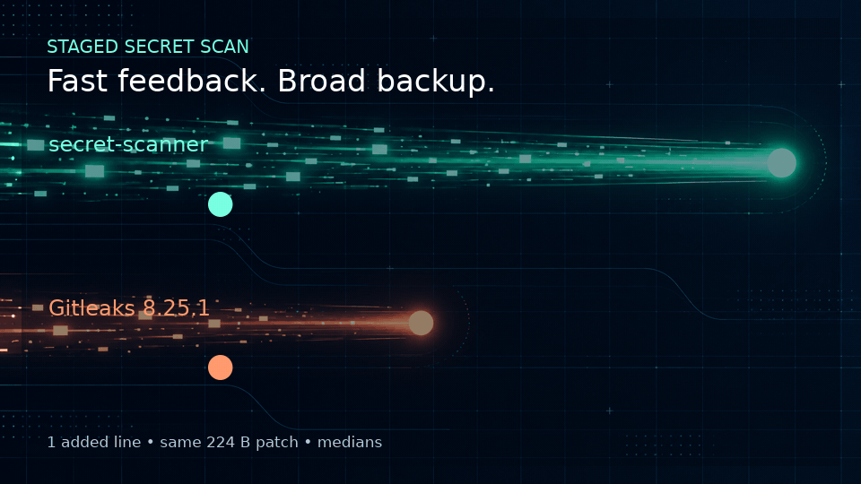

# secret-scanner

A low-latency Rust tripwire for common secrets in staged Git changes.



`secret-scanner` optimizes the feedback loop, not maximum coverage. Run it
before every commit, then keep a pinned Gitleaks commit-range scan as the
authoritative server-side gate.

## Quick start

Requirements: Git and Rust 1.85 or newer.

```bash
git clone https://git.ardenone.com/jedarden/fast-secret-scanner.git
cd fast-secret-scanner
cargo build --release
git add path/to/change
./target/release/secret-scanner
```

The host used for this repository redirects Cargo's target directory to
`/build/fast-secret-scanner`; a normal Cargo installation uses `./target`.

The default command scans only lines added to the Git index. Output never
includes the matching value:

```text
path/to/file:42:github-token
```

| Exit | Meaning | Next action |
|---:|---|---|
| `0` | No candidate found | Continue |
| `1` | One or more candidates found | Remove or rotate them, then restage |
| `2` | Usage or execution error | Fix the invocation; do not treat it as clean |

## Common commands

```bash
# Scan staged additions (recommended local gate).
secret-scanner

# Scan every tracked file.
secret-scanner --tracked --summary

# Scan paths supplied on the command line.
secret-scanner path/to/file path/to/directory

# Scan a stream and give findings a safe label.
some-producer | secret-scanner --stdin --path-label generated.txt
```

Minimal `.git/hooks/pre-commit`:

```sh
#!/bin/sh
exec /absolute/path/to/secret-scanner
```

## What it detects

- High-signal AWS, GitHub, GitLab, Slack, Stripe, Google, SendGrid, npm,
  Hugging Face, Anthropic, OpenAI, DigitalOcean, and Databricks token shapes.
- Credential-like assignments, authorization headers, curl credentials, and
  credentials embedded in URIs.
- PEM private-key headers, JWTs, and newly added Kubernetes Secret blocks.

It does **not** scan Git history, unpack archives, recursively decode content,
validate credentials with providers, or reproduce Gitleaks' complete rule and
allowlist system. See [exact rule coverage and gaps](research/rule-coverage.md).

## Measured performance

These are medians from the same staged patch and host, with Gitleaks recursive
decoding disabled:

| Staged addition | secret-scanner | Gitleaks 8.25.1 | Ratio |
|---|---:|---:|---:|
| 1 line / 224 B patch | 8 ms | 539 ms | ~67x |
| 5,000 lines / 169,088 B patch | 30 ms | 499 ms | ~17x |

The shared host was heavily loaded, so treat the ratios as one reproducible
observation rather than a universal claim. Run `scripts/benchmark.sh` on your
own machine. The raw data is in
[`research/benchmark-results.tsv`](research/benchmark-results.tsv), and the
method and Gitleaks comparison are in
[`research/gitleaks-performance.md`](research/gitleaks-performance.md).

Against the redacted research corpus, this scanner covered 136 of 159 unique
Gitleaks locations (85.5%). The 23 misses were all from Gitleaks' broad generic
rule. This is evidence about that corpus, not a general recall estimate.

## Why it starts quickly

- One `git diff --cached --unified=0` process supplies the default scan.
- Only added lines are inspected.
- Bounded byte checks replace a general runtime rule engine.
- The dependency-free binary is single-threaded and does no recursive decode.
- Detectors return rule IDs, never the candidate text.

## Documentation map

| Reader or task | Start here |
|---|---|
| Evaluating the security tradeoff | [`notes/OBJECTIVE.md`](notes/OBJECTIVE.md) |
| Integrating or changing the scanner | [`AGENTS.md`](AGENTS.md) |
| Understanding the implementation | [`notes/design.md`](notes/design.md) |
| Auditing rules and known gaps | [`research/rule-coverage.md`](research/rule-coverage.md) |
| Reproducing performance claims | [`research/gitleaks-performance.md`](research/gitleaks-performance.md) |
| Reviewing the redacted findings study | [`research/findings-2026-09-27.md`](research/findings-2026-09-27.md) |

## Safe operating model

Use `secret-scanner` as the fast first gate and Gitleaks as the comprehensive
second gate. Never allowlist an unknown candidate merely because it appears in
documentation or a template. If a value could have worked, revoke or rotate it
before removing the finding.
